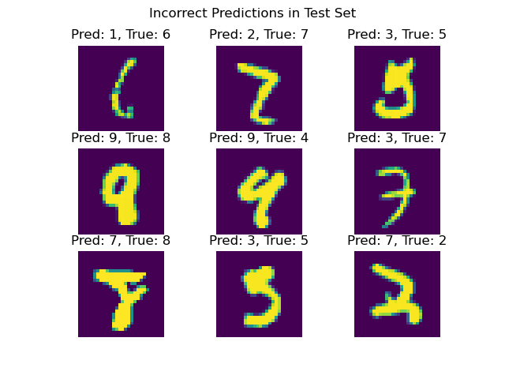
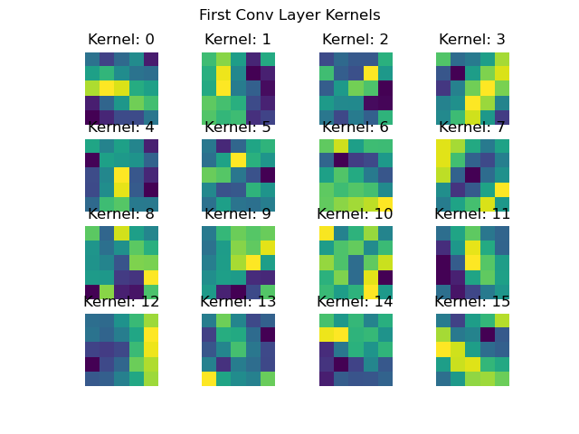
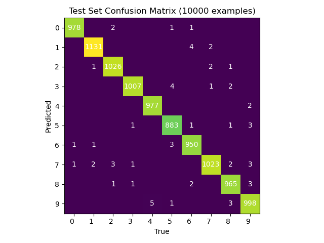
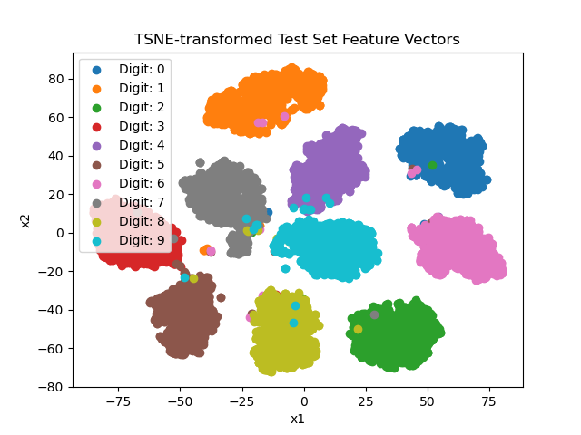
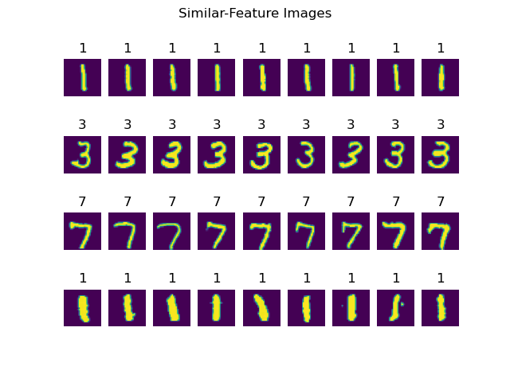

# MNIST Classification

## Training
Download MNIST into the `data/` folder (no longer provided by Pytorch), and run `python train.py` to train the improved ConvNet model. 

## Evaluation
After training, you can run `python util/problem8.py` to generate the model evaluation visualizations.

